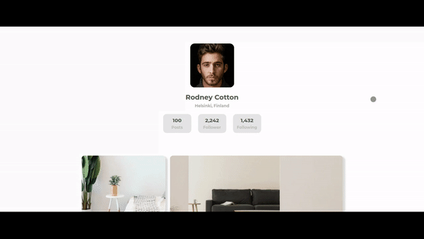

<!-- Please update value in the {}  -->

<h1 align="center">Gallery Page</h1>

   Solution for a challenge from  <a href="http://devchallenges.io" target="_blank">Devchallenges.io</a>.

  <h3>
    <a href="#">
      Solution
    </a>
     | 
    <a href="https://devchallenges.io/challenges/Jymh2b2FyebRTUljkNcb">
      Challenge
    </a>
  </h3>

<!-- TABLE OF CONTENTS -->

## Table of Contents

- [Overview](#overview)
  - [Built With](#built-with)
- [Features](#features)
- [Contact](#contact)
- [Acknowledgements](#acknowledgements)

<!-- OVERVIEW -->

## Overview

A sample gird gallery page build it with mobile first.

### Built With

- [HTML](https://html5.org)
- [CSS](https://www.w3.org/Style/CSS/Overview.en.html)

## Features

This application/site was created as a submission to a [DevChallenges](https://devchallenges.io/challenges) challenge. The [challenge](https://devchallenges.io/challenges/Jymh2b2FyebRTUljkNcb) was to build an application to complete the given user stories.

## Acknowledgements

- [Css reset](https://gist.github.com/Thiago-spart/efaec945626d26557931b4ee879bdb58)

## Contact

- GitHub [@Thiago-spart](https://github.com/Thiago-spart)
- Twitter [@thiago_Spart](https://twitter.com/thiago_Spart)
- Linkedin [Thiago Moraes](https://www.linkedin.com/in/thiago-moraes-0b71971a9/)
